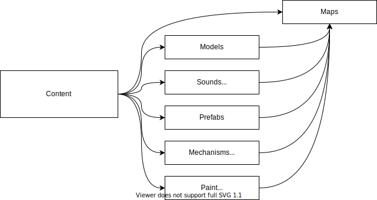
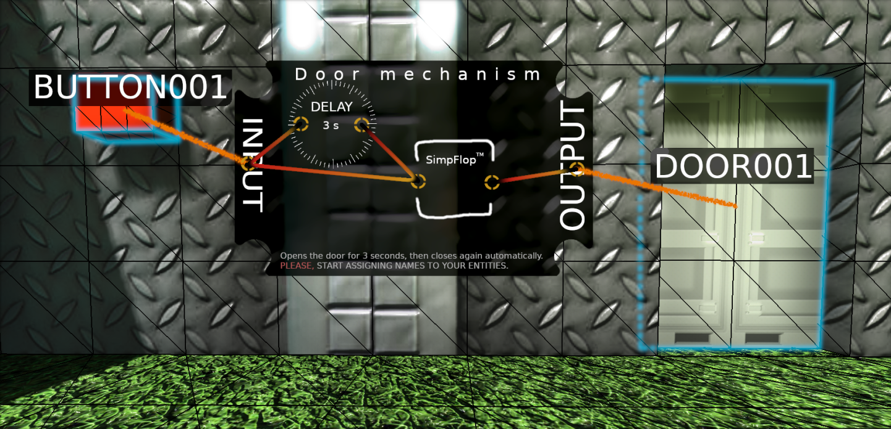

# Editing Tools

## Main Motivation

These concepts have to play nicely with how the world is built up at the core and how these core functionalities can be used to efficiently navigate and work on content. In this document we may explore and define the user experience the possibilities and tooling required.

Think of the content editor as another gamemode.

The map is a playable 3D world composition of all kinds of content.
The assets needed to craft a map need to be easy to access, incorporate and share.

When creating or modifying content, the tooling to craft all kinds of content should allow the following methods cooperatively.
Depending on the size, shape and type of content, there are different tools and views needed.

* [switch context](context)
    * map editor
    * texture/paint editor
    * environment editor (light, fog, water)
    * prefab editor
    * model editor
    * mechanism editor
* [navigate](#navigate)
    * move (slow, fast)
    * zoom in, zoom out
    * jump, bookmark jump-spots
    * switch movement mode (orbit, translate, lock view, 2D)
    * cameras (set, place, use)
* [select](#select)
    * group
    * focus on single part or group (recursively)
    * unfocus (exit to parent part or main world)
* [manage](#manage)
    * choose assets
    * share current workpiece as asset
* [build](#build)
    * create
    * copy
    * paste
    * cut
    * orientate (rotate, flip)
    * resize
    * set anchor/origin ()
    * change layer
    * mirror (axis)
    * repeat (axis, multiple axis, diagonal )
* [test](#test)
    * switch between editing and gaming
    * statistics/heatmap (placing enough cover)
    * gameplay balancer (spread of ammo, health, player spawns, hot spots, dead ends)
    * add/remove bots
* paint
    * apply texture/paint/blendmap to geometry
    * face
    * cube
    * blend
* mechanism
    * connect
    * disconnect
    * apply properties
    * assign type

## Types of guiding/aiding/supportive UI

* Hinting
    * curves
    * cubes
    * faces
    * heatmaps
* UI

For some editing modes, especially mechanisms, it is not enough to show the effect as it is visible when played. The underlying logic needs to be visible for the editor in an intuitive 2D positioned way. This is called UI hinting and is done with UI windows or cube faces, outlines etc to hint.
**Example:** Which part of a wall has to be activated (shot, touched, keybinding activated) in order to open a door, with closing delay or reactivation delay.

Combining individual cubes and mechanisms (entities) will be referred as called [visual scripting](./3d-visual-scripting).

::: tip

All these methods to interact with the world should be pluggable and configurable to the core.
Maybe a map requires to have a gun that can shoot away only certain blocks.

:::

Think of the content editor as just another set of toolings and mechanisms. We can provide a default set of tools, but to enable the map editor to have the same growth as the contents to play, it should be open for extension by the community using the same mechanisms to build and publish content.

### Notable examples

Minecraft's creative mode feels and works almost exactly like survival. You have the same tools to create worlds, but your possibilities are just a bit extended and a few limiting mechanisms like health or gravity removed.

To provide an intuitive editing experience, we need to make decisions to have the most important things to switch to (like gravity) on e.g. F1 - F12 keys.

## Types of Content

### Context

### Navigate

_Taken from Cube2 Sauerbraten - configurable display of relevant infos_

### Manage

### Editing Modes

At the core, editing specific parts of a map can be divided into these aspects or tasks:

* Cubes, Octree, Layout, Details
* Textures
* Lights, Environment (Skybox, Fog, Skylight)
* Blendpaint
* heightmap
* Entity tuning

Inspired by Garry's mod, I had always the idea of having an editors toolbar, where you can switch between the different modes or tools

`/blendpaintmode` or `/hmapedit` do nothing more than disabling other behavior of scroll (DeltaDoModifier).
The idea is to move away from GUIs and move the information and modes perhaps even tools to the HUD to create something like an inventory. Where editing Cubes is the main and default tool.

### Contextsensitive Options

Modern GUIs are context sensitive. How? If you are in spectator mode, you are not shown any editing GUI, if you are not master of the server, you do not need to see buttons for master commands like spectate/unspectate.

With these tools, if you are in a certain mode, you can focus on the task at hand and have all information available that you require for that specific task.

* Cubes, Octree, Layout, Details
* Textures
* Lights, Environment (Skybox, Fog, Skylight)
* Blendpaint
* heightmap
* Entity tuning

## Benefits

 * No more command remembering
 * Better Newbie onboarding 
 * Easier to edit

## Implementation

More info coming soon

