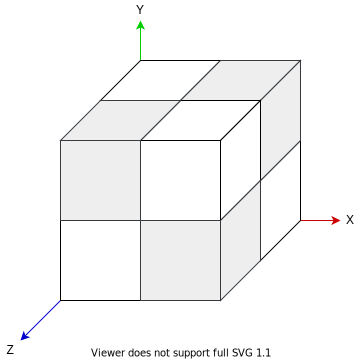

# Inexor Octree File Format (Proposal, WIP)

The Inexor octree format describes the structure of the maps (and even models) created in Inexor.

This file discusses the contents of the Inexor Octree Format in detail.

The key words "MUST", "MUST NOT", "REQUIRED", "SHALL", "SHALL NOT", "SHOULD", "SHOULD NOT", "RECOMMENDED", "MAY", and "OPTIONAL" in this document are to be interpreted as described in [RFC 2119](https://tools.ietf.org/html/rfc2119).

## Numbers

The octree file format ~~(should)~~ only requires **unsigned** integers. If not other noted, all numbers are **little-endian**, **unsigned, 32-bit** **integers**. ~~If other number formats (floats, BCDs) are used, they are also little-endian and unsigned and use 32-bit of space (if not other noted).~~

## Octree

The octree in Inexor is saved in a recursive format. The octree is used to represent the cubes of a map. A cube can either consist of

* 8 octants (i.e. sub-cubes, where Inexor recurses down)
* One, full cube
* Nothing

Furthermore, Inexor allows the indentation of the corners of its cubes.

This results in the first two bits describing the type of the cube:

`2 bits`: unsigned integer. Type of the cube:

* `0 = EMPTY` The cube is inexistant, nothing to render.
* `1 = FULL` The cube full. No further subdivision into octants. No indented edges.
* `2 = INDENTED` The octree ends here, but the cube has at least one indented edge.
* `3 = OCTANTS` The octree is subdivided into 8 octants (i.e., sub-cubes).

If the cube is `EMPTY` or `FULL`, then no further bits are used to describe this cube or its octants (as it has none).

The next bits describe its siblings.

If the cube is `INDENTED`, then the next bit describes whether the corner on the X-edge is indented. If it is, the next 3 bits describe the indentation level: 1 plus the 3-bits as unsigned int. Otherwise the next bit describes if the Y-edge is indented, and afterwards with the same procedure for the Z-edge. Furthermore, the cube must be rendered as 12 triangles (6 per plane). Also with indentations, a cubes side is always convex.

If the cube is `OCTANTS`, then we recurse down in the structure and start with the first octant (see *Octant Order*).

### Octant Order and Edge Order

Each sibling is one cube, saved as explained before. If the cube again consits of 8 octants, they need to be saved in a predefined order. Regarding the image above, the cubes are saved clockwise, first with the lower z-values, starting with lowest values. Explicitly, the order of the 8 octants is as follows:

| Index | X      | Y      | Z      |
|------:|--------|--------|--------|
|    0. | lower  | lower  | lower  |
|    1. | lower  | lower  | higher |
|    2. | lower  | higher | lower  |
|    3. | lower  | higher | higher |
|    4. | higher | lower  | lower  |
|    5. | higher | lower  | higher |
|    6. | higher | higher | lower  |
|    7. | higher | higher | higher |

Also, when the cube is indented, the edges are processed in the same order.
